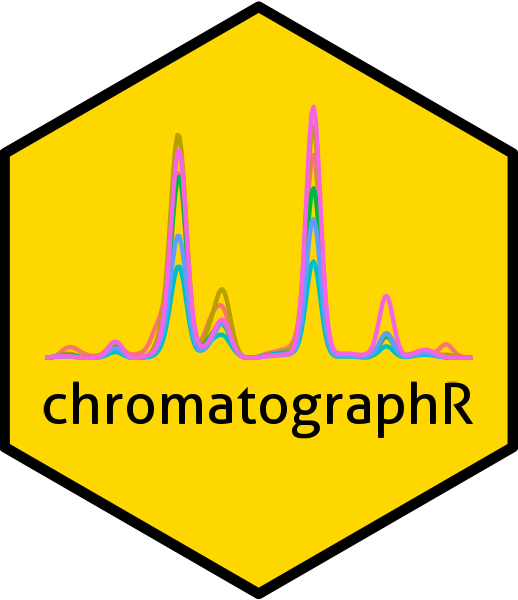

# chromatographR <a href='https://ethanbass.github.io/chromatographR/'></a>

<!-- badges: start -->
  [](https://cran.r-project.org/package=chromatographR)
  [](https://cran.r-project.org/package=chromatographR)
  [](https://github.com/ethanbass/chromatographR/actions/workflows/R-CMD-check.yaml)
  <!-- badges: end -->

## Overview
`chromatographR` is a package for the reproducible analysis of HPLC-DAD chromatographic data in R. It can also be used to analyze other "simple" chromatographic data like GC-FID, HPLC-UV, or HPLC-FD.
  
## Installation

chromatographR can now be installed from CRAN:

```
install.packages("chromatographR")
```

You can also install the latest development version of chromatographR from GitHub using the devtools package:

```
install.packages("devtools")
devtools::install_github("https://github.com/ethanbass/chromatographR/")
```

To build the vignette, include the argument `build_vignettes=TRUE` (**Note:** this will take considerably longer than building the package without the vignette).

## Usage

#### Importing data
chromatographR can now import ChemStation and MassHunter files directly (using the [Aston](https://github.com/bovee/aston) or [Entab](https://github.com/bovee/entab) parsers wrapped by [chromConverter](https://ethanbass.github.io/chromConverter/)) as well as regular `csv` and `ascii` files.

#### Analysis
Please see the [vignette](https://ethanbass.github.io/chromatographR/articles/chromatographR.html) included with the package for details on the application of chromatographR for the analysis of HPLC data. A second vignette with a suggested workflow for the analysis of GC-FID data will be forthcoming soon. 

## Contributing

Contributions to the package are very welcome. Please get in touch (preferable by opening a GitHub [issue](https://github.com/ethanbass/chromatographR/issues)) to discuss any suggestions or to file a bug report. Some good reasons to file an issue:

- You found an actual bug.  
- You're getting a cryptic error message that you don't understand.  
- You have a file format you'd like to read that isn't currently supported by chromatographR.  (If you do this, please make sure to include a link to an example file!)  
- You have a new feature you'd like to see implemented.  

## Citation:

If you use chromatographR in published work, please cite it as follows:

Bass, E. (2022). chromatographR: chromatographic data analysis toolset (version 0.4.4).
https://cran.r-project.org/package=chromatographR/
