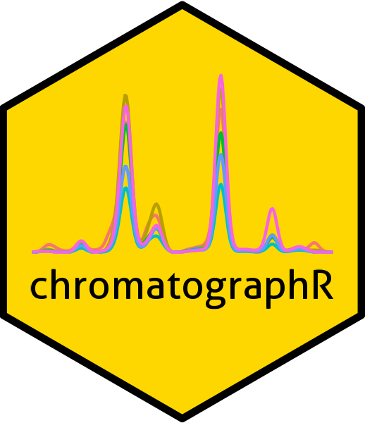

# chromatographR <a href='https://ethanbass.github.io/chromatographR/'></a>

<!-- badges: start -->
  [](https://github.com/ethanbass/chromatographR/)
  [](https://github.com/ethanbass/chromatographR/actions/workflows/R-CMD-check.yaml)
  <br>
  [](https://ethanbass.r-universe.dev/chromatographR)
  [](https://cran.r-project.org/package=chromatographR)
  <br>
  [](https://cran.r-project.org/package=chromatographR)
  [](https://cran.r-project.org/package=chromatographR)
  <br>
  [](https://doi.org/10.5281/zenodo.7016988)
   <!-- badges: end -->

## Overview

`chromatographR` provides a vendor-agnostic and fully scriptable alternative  for the reproducible analysis of HPLC-DAD and other chromatographic data (e.g., GC-FID, HPLC-UV, or HPLC-FD) in R. It enables a scriptable workflow as an open-source alternative to proprietary chromatography software, including:

- **Pre-processing**: smoothing, baseline correction, and interpolation
- **Retention-time alignment**: parametric time warping (PTW) and variable penalty dynamic time warping (VPdtw)
- **Peak detection and integration**: Gaussian, exponential-Gaussian hybrid (EGH), or raw trapezoidal integration
- **Peak table construction**: hierarchical clustering to match peaks across samples
- **Downstream analysis**: metadata attachment, normalization, UV spectral analysis, and visualization
  
## Installation

chromatographR can now be installed from CRAN:

```
install.packages("chromatographR")
```

However, it's recommended to install the latest development version of chromatographR from GitHub using the devtools package:

```
if (!require("pak", quietly=TRUE)) install.packages("pak")
pak::pak("ethanbass/chromatographR")
```

or from R Universe:

```
install.packages("chromatographR", repos="https://ethanbass.r-universe.dev/")
```

## Usage

#### Importing data
chromatographR can import a variety of vendor formats, including 'Agilent ChemStation' and 'MassHunter' files. This is accomplished using parsers from my chromConverter package. See the [chromConverter page](https://ethanbass.github.io/chromConverter/) for a detailed list of supported formats. Alternatively, chromatographR can also be used with regular `csv` files.

#### Analysis
Please see the [vignette](https://ethanbass.github.io/chromatographR/articles/chromatographR.html) included with the package for details on the application of chromatographR for the analysis of HPLC data. Additional articles are available on the pkgdown website: 1) a suggested [workflow for the analysis of GC-FID data](https://ethanbass.github.io/chromatographR/articles/GC-FID.html) (*Polistes* cuticular hydrocarbons) and 2) an introductory guide to the [programmatic analysis of UV spectra](https://ethanbass.github.io/chromatographR/articles/uv_spectra.html).

## Contributing

Contributions are always welcome. Please get in touch (preferable by opening a GitHub [issue](https://github.com/ethanbass/chromatographR/issues)) to discuss any suggestions or to file a bug report. Some good reasons to file an issue:

- You think you've found a bug.  
- You're getting a cryptic error message that you don't understand.  
- You have a file format you'd like to read that isn't currently supported by chromatographR.  (If you do this, please make sure to include a link to an example file!)  
- You have a new feature you'd like to see implemented.  

Also see the [contributing.md](https://github.com/ethanbass/chromatographR/blob/master/.github/contributing.md) page for more details.

(**Note:** Please post questions about file conversions to the [chromConverter](https://github.com/ethanbass/chromConverter/issues) page).

## Citation:

If you use chromatographR in published work, please cite it as follows:

Bass, E. (2026). chromatographR: Chromatographic Data Analysis Toolset (version 0.8.0). http://doi.org/10.5281/zenodo.6944334

If your workflow includes data import with chromConverter, please also cite:

Bass, E. (2026). chromConverter: Chromatographic File Converter. http://doi.org/10.5281/zenodo.6792521.
