# Analysis of *Polistes* cuticular hydrocarbons with GC-FID

``` r

library(chromatographR)
#> Registered S3 method overwritten by 'chromatographR':
#>   method      from
#>   predict.ptw ptw
library(rdryad)
library(vegan)
#> Loading required package: permute
library(ggplot2)
```

### Introduction

While the basic workflow is similar for analyzing different types of
chromatographic data with `chromatographR`, there are a few important
differences when analyzing GC-FID data (or other 1-dimensional data).
This vignette highlights some important considerations when using
chromatographR to analyze GC-FID data (or other 2D chromatography data).

To demonstrate the use of `chromatographR` for the analysis GC-FID data,
we will analyze a dataset on cuticular hydrocarbons (CHCs) composition
in four species of paper wasps (*Polistes spp.*) collected by Dr. Andrew
Legan ([Legan 2022](#ref-legan2022); [Legan et al.
2022](#ref-legan2022a)). The dataset includes CHCs collected from
*Polistes dominula* (european paper wasp), *Polistes exclamans* (common
paper wasp), *P. fuscatus* (northern paper wasp), and *P. metricus*
(metric paper wasp). As in other social insects, cuticular hydrocarbons
serve as chemical cues mediating a number of social behaviors in paper
wasps ([Legan et al. 2021](#ref-legan2021)), including nestmate
recognition ([Gamboa et al. 1986](#ref-gamboa1986); [Gamboa et al.
1996](#ref-gamboa1996); [Bruschini et al. 2011](#ref-bruschini2011)),
establishment of social hierarchies ([Jandt et al.
2014](#ref-jandt2014)) and mate choice ([Reed and Landolt
1990](#ref-reed1990)).

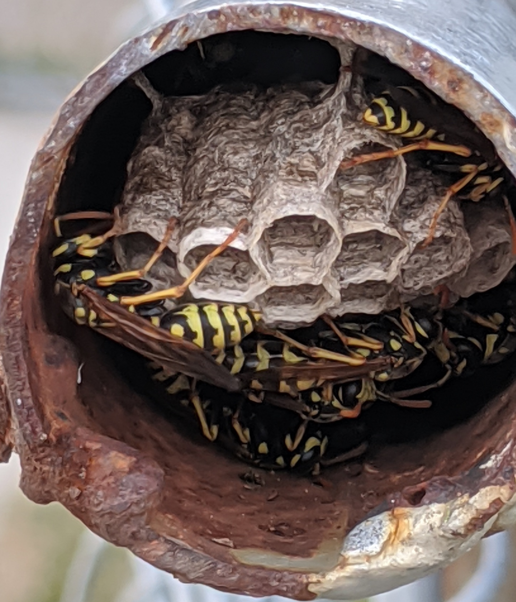

*P. dominula* ([Kranz 2020](#ref-kranz2020))

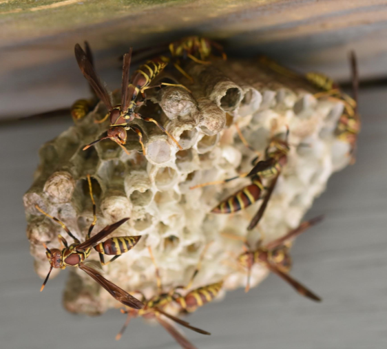

*P. exclamans* (© Andrew Legan)

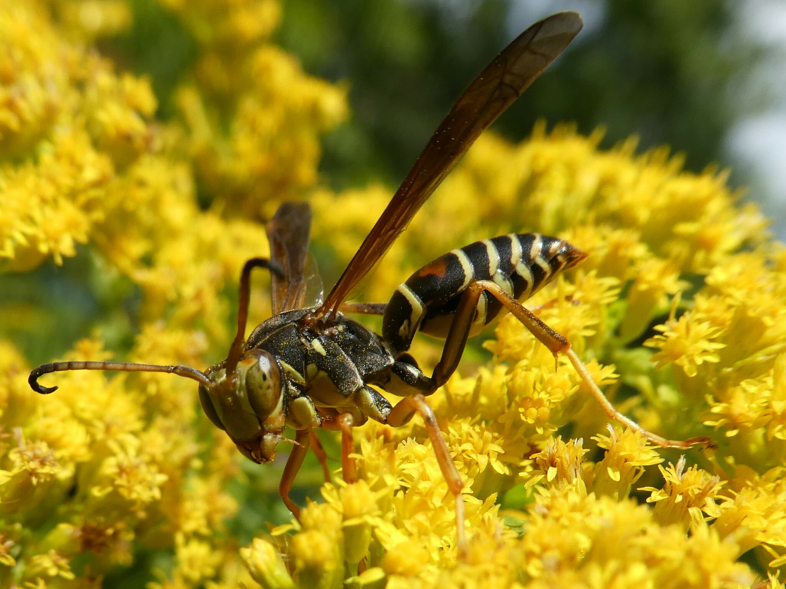

*P. fuscatus* ([Cook 2022](#ref-cook2022))

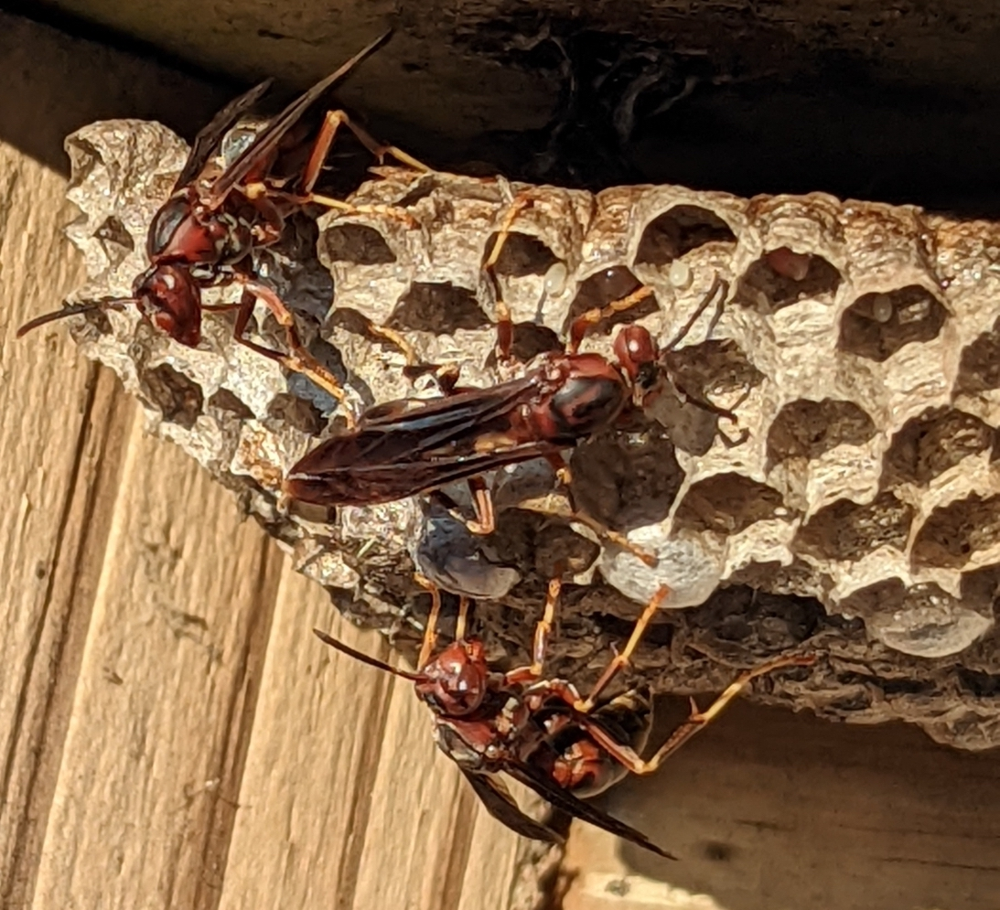

*P. metricus* ([Drabik-Hamshare 2022](#ref-drabik-hamshare2022))

Figure 1: *Polistes* species includes in this study.

``` r

is_github_actions <- Sys.getenv("GITHUB_ACTIONS") == "true"

if (is_github_actions){
  # Load files from GitHub (https://github.com/ethanbass/10_5061_dryad_wpzgmsbr8/releases/tag/v1.0)
  tmp <- tempfile(fileext = ".zip")
  curl::curl_download("https://github.com/ethanbass/10_5061_dryad_wpzgmsbr8/archive/refs/tags/v1.0.zip", destfile = tmp)
  unzip(tmp, exdir = "./data/")
  files <- list.files("./data/10_5061_dryad_wpzgmsbr8-1.0", full.names = TRUE)
} else{
  # Load files from Dryad
  files <- rdryad::dryad_download("10.5061/dryad.wpzgmsbr8")[[1]]
}

chrom_paths <- grep("README|METADATA|ANNOTATED", files, invert = TRUE, 
                    value = TRUE)
dat <- read_chroms(chrom_paths, format_in = "shimadzu_fid")
#> Downloading uv...Done!

path_to_metadata <- grep("METADATA", files, value = TRUE)
meta <- read.csv(path_to_metadata, sep = "\t")
```

In order to get a good alignment, it is helpful to remove the solvent
peak. To accomplish this, we can use the `preprocess` function to remove
the first four minutes of the chromatogram. We also reduce the time-axis
resolution (from 40 ms to 300 ms) since it drastically reduces
computation time while seemingly having little effect on the accuracy of
the integration results.

``` r

dat.pr <- preprocess(dat, spec.smooth = FALSE, dim1 = seq(from = 4, to = 59.9, by = .005), # .005 minutes = 300 ms
                     cl = 1)
names(dat.pr) <- gsub(".txt", "", names(dat.pr))
```

We can then group the chromatograms by species for further analysis.

``` r

species <- c(dominula = "DOMINULA", exclamans.= "EXCLAMANS", 
             fuscatus = "FUSCATUS", metricus = "METRICUS")

species_idx <- lapply(species, function(sp){
  which(names(dat.pr) %in% meta[which(meta$POLISTES_SPECIES == sp),
                                     "SAMPLE_ID"])
})
```

We can extract the peaks from the alkane ladder using the `get_peaks`
function and plot the integrated peak areas. To eliminate small peaks
that are not part of the alkane ladder, we use the `filter_peaks`
function to remove features that do not have an amplitude of at least
10^4 response units.

``` r

ladder <- grep("LADDER", names(dat.pr))
pks <- get_peaks(dat.pr[ladder], time.units = "s")
#> Warning in resolve_deprecated(time.units, time_unit): The 'time.units' function
#> is deprecated. Please use 'time_unit' instead.
plot(pks, chrom_list = dat.pr[ladder])
```

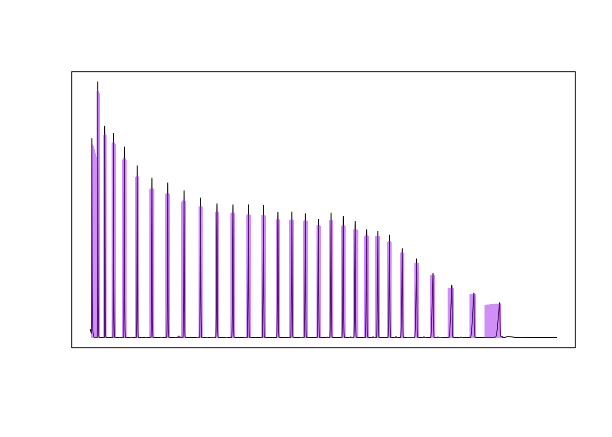

``` r

pks_f <- filter_peaks(pks, min_height = 10000)
```

In this case, we also have integration results from ‘Shimadzu
LabSolutions’, so we can check the integration results provided by
`chromatographR` against the results from LabSolutions.

``` r

path_to_annotated_alkanes <- grep("ANNOTATED", files[[1]], value = TRUE)
alkanes <- read.csv(path_to_annotated_alkanes, sep="\t")
```

``` r

# check equality of retention times
# all.equal(alkanes$RT[-1], pks_f$ALKANE_LADDER[[1]]$rt)

par(mfrow=c(1,2))

plot(pks_f$ALKANE_LADDER[[1]]$area ~ alkanes$Area[-1], pch = 20,
     xlab = "Area (LabSolutions)", ylab = "Area (chromatographR)", 
     main = "Area")
m <- lm(pks_f$ALKANE_LADDER[[1]]$area ~ alkanes$Area[-1])
abline(m)
legend("bottomright", bty = "n", 
       legend = bquote(R^2 == .(format(summary(m)$adj.r.squared, digits = 4))))

plot(pks_f$ALKANE_LADDER[[1]]$height ~ alkanes$Height[-1], pch = 20,
     xlab = "Area (LabSolutions)", ylab = "Area (chromatographR)", 
     main = "Height")
m <- lm(pks_f$ALKANE_LADDER[[1]]$height ~ alkanes$Height[-1])
abline(m)
legend("bottomright", bty = "n", 
       legend = bquote(R^2 == .(format(summary(m)$adj.r.squared, digits = 4))))
```

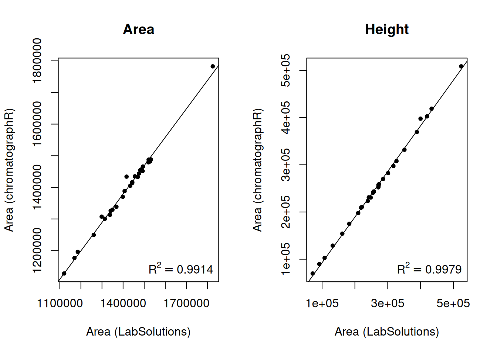

Reassuringly, the peak areas and heights estimated by chromatographR are
very similar to the results provided by LabSolutions.

### Alignment of chromatograms

We can align chromatograms by species using variable dynamic time
warping.

``` r

warp_dominula <- suppressWarnings(correct_rt(dat.pr[species_idx$dominula], 
                                            alg = "vpdtw", 
                                            what = "corrected.values", 
                                            plot_it = TRUE, verbose = TRUE, 
                                            penalty = 1, maxshift = 100))
#> Selected chromatogram 9 as best reference.
#> Fitting VPdtw warping models.
```

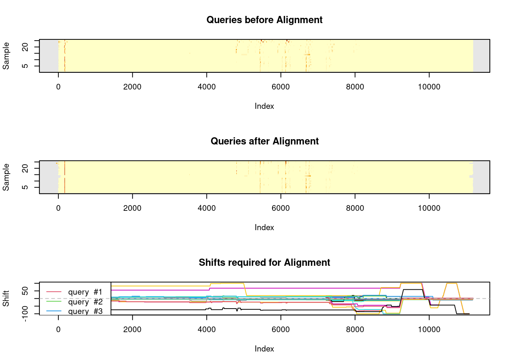

    #> Applying VPdtw warping models to chromatograms.

    warp_metricus <- suppressWarnings(correct_rt(dat.pr[species_idx$metricus],
                                                alg = "vpdtw",
                                                what = "corrected.values",
                                                plot_it = FALSE, verbose = FALSE,
                                                penalty = 2, maxshift = 100))

    warp_exclamans <- suppressWarnings(correct_rt(dat.pr[species_idx$exclamans],
                                                 alg = "vpdtw",
                                                 what = "corrected.values",
                                                 plot_it = FALSE, verbose = FALSE,
                                                 penalty = 2, maxshift = 200))

    warp_fuscatus <- suppressWarnings(correct_rt(dat.pr[species_idx$fuscatus],
                                alg = "vpdtw", what = "corrected.values",
                                plot_it = FALSE, verbose = FALSE,
                                penalty = 2, maxshift = 200))

``` r

warp_all <- suppressWarnings(correct_rt(dat.pr[-1], alg = "vpdtw",
                       what = "corrected.values", plot_it = FALSE,
                       verbose = FALSE, penalty = 2, maxshift = 200))
```

As a sanity check, we can compare the single species alignments for each
species to the multi-species alignment of the corresponding
chromatograms.

Utility function to format text in base R plots with italics.

``` r

format_italics <- function(str) {
  spl <- strsplit(str, "\\*")[[1]]
  non_empty <- spl[spl != ""]
  bquote(paste(italic(.(non_empty[1])), .(non_empty[2])))
}
```

``` r

par(mfrow=c(3,1))
plot_chroms_heatmap(dat.pr[species_idx$metricus], show_legend = FALSE, 
                    title = format_italics("*P. metricus* (raw data)"), xlim=c(25, 50))

plot_chroms_heatmap(warp_metricus, show_legend = FALSE, 
                    title = format_italics("*P. metricus* (single-species alignment)"),
                    xlim=c(25, 50))

plot_chroms_heatmap(warp_all[grep("PMET", names(warp_all))], show_legend = FALSE,
                    title = format_italics("*P. metricus* (multi-species alignment)"),
                    xlim=c(25, 50))
```


``` r

par(mfrow=c(3,1))
plot_chroms_heatmap(dat.pr[species_idx$fuscatus], show_legend = FALSE, 
                    title = format_italics("*P. fuscatus* (raw data)"),
                    xlim=c(20,45))

plot_chroms_heatmap(warp_fuscatus, show_legend = FALSE, 
                    title = format_italics("*P. fuscatus* (single-species alignment)"),
                    xlim=c(20,45))

plot_chroms_heatmap(warp_all[grep("PFUS", names(warp_all))], show_legend = FALSE,
                    title = format_italics("*P. fuscatus* (multi-species alignment)"),
                    xlim=c(20,45))
```

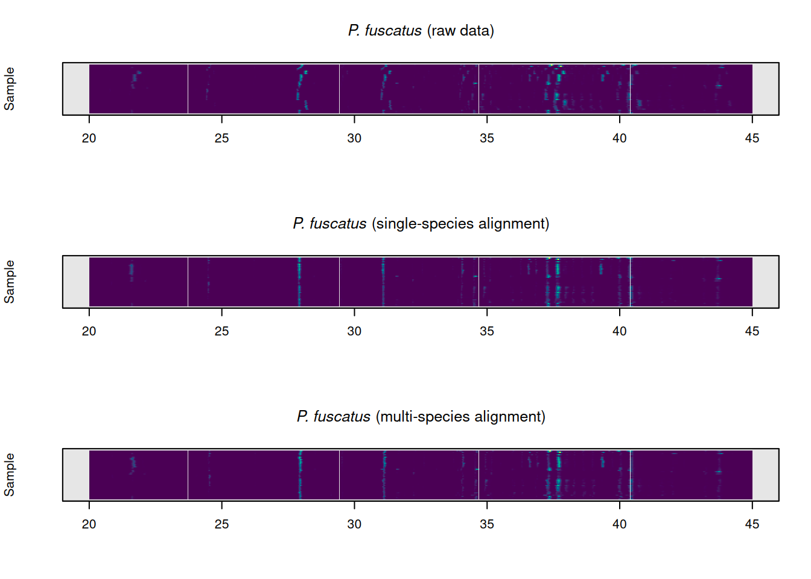

``` r

par(mfrow=c(3,1))
plot_chroms_heatmap(dat.pr[species_idx$dominula], show_legend = FALSE, 
                    title = format_italics("*P. dominula* (raw data)"),
                    xlim=c(25,45))

plot_chroms_heatmap(warp_dominula, show_legend = FALSE, 
                    title = format_italics("*P. dominula* (single-species alignment)"),
                    xlim=c(25,45))

plot_chroms_heatmap(warp_all[grep("PDOM", names(warp_all))], show_legend = FALSE,
                    title = format_italics("*P. dominula* (multi-species alignment)"),
                    xlim=c(25,45))
```

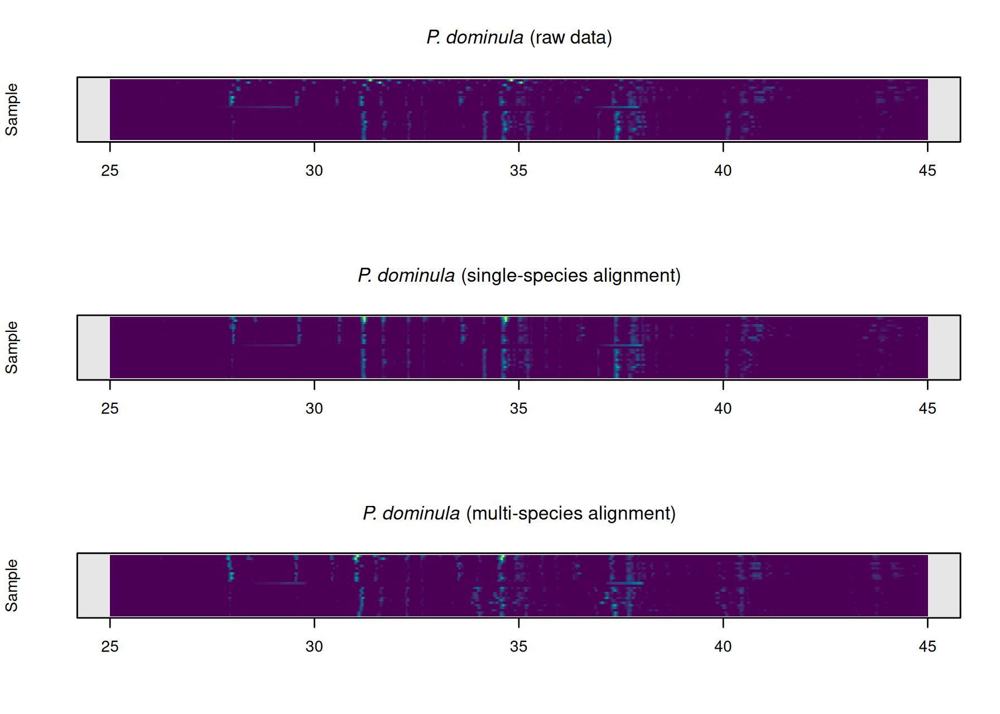

``` r

par(mfrow = c(3,1))
plot_chroms_heatmap(dat.pr[species_idx$exclamans], show_legend = FALSE, 
                    title = format_italics("*P. exclamans* (raw data)"),
                    xlim = c(30,40))

plot_chroms_heatmap(warp_exclamans, show_legend = FALSE, 
                    title = format_italics("*P. exclamans* (single-species alignment)"),
                    xlim = c(30,40))

plot_chroms_heatmap(warp_all[grep("PEXC", names(warp_all))], show_legend = FALSE,
                    title = format_italics("*P. exclamans* (multi-species alignment)"),
                    xlim = c(30,40))
```

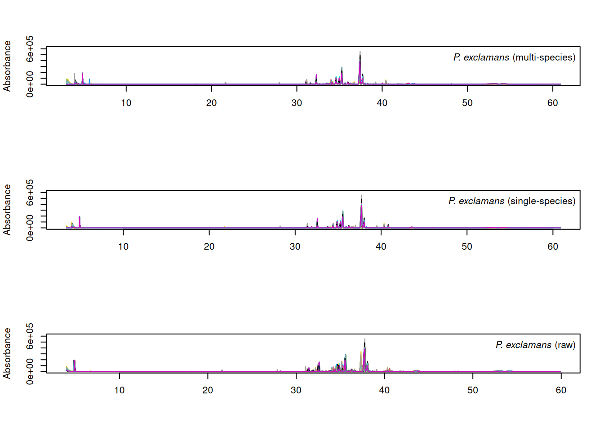

In general, the results are quite similar between multi-species and
single species alignments, though the single-species alignments are
noticeably better in some areas. Since we want to compare CHCs across
species, we will proceed with the imperfect multi-species alignments.

### Integration and peaktable assembly

``` r

pks <- get_peaks(warp_all)
pktab <- get_peaktable(pks)
pktab <- attach_metadata(pktab, metadata = meta, column = "SAMPLE_ID")
```

### Analysis of cuticular hydrocarbon composition

``` r

m <- vegan::adonis2(pktab$tab ~ POLISTES_SPECIES + STATE + SEX + LAT + LON,
               data = pktab$sample_meta, method = "manhattan",
               na.action = na.omit, by = "margin")
m
#> Permutation test for adonis under reduced model
#> Marginal effects of terms
#> Permutation: free
#> Number of permutations: 999
#> 
#> vegan::adonis2(formula = pktab$tab ~ POLISTES_SPECIES + STATE + SEX + LAT + LON, data = pktab$sample_meta, method = "manhattan", by = "margin", na.action = na.omit)
#>                   Df   SumOfSqs      R2      F Pr(>F)    
#> POLISTES_SPECIES   3 1.3191e+11 0.12374 9.1912  0.001 ***
#> STATE              7 1.2344e+11 0.11579 3.6861  0.001 ***
#> SEX                1 4.1426e+10 0.03886 8.6592  0.001 ***
#> LAT                1 8.1923e+09 0.00768 1.7124  0.105    
#> LON                1 1.3227e+10 0.01241 2.7648  0.025 *  
#> Residual         105 5.0233e+11 0.47119                  
#> Total            118 1.0661e+12 1.00000                  
#> ---
#> Signif. codes:  0 '***' 0.001 '**' 0.01 '*' 0.05 '.' 0.1 ' ' 1
```

As one might expect, the permanova results shows that species is the
largest contributor to the variance in CHC profiles (R²_(marginal) =
0.12), followed by state of origin (R²_(marginal) = 0.12) and sex
(R²_(marginal) = 0.04).

Modified `ggordiplot` function with added `shape` argument.

``` r

# ggordiplot function (modified from https://github.com/jfq3/ggordiplots/blob/master/R/gg_ordiplot.R) with added shape argument

gg_ordiplot <- function (ord, groups, shape = NULL, scaling = 1, choices = c(1, 2), 
                         kind = c("sd", "se", "ehull"), conf = NULL, 
                         show.groups = "all", ellipse = TRUE, 
                         label = FALSE, hull = FALSE, spiders = FALSE, 
                         pt.size = 3, plot = TRUE) {
  x <- y <- cntr.x <- cntr.y <- Group <- NULL
  groups <- as.factor(groups)
  if (show.groups[1] == "all") {
    show.groups <- as.vector(levels(groups))
  }
  df_ord <- vegan::scores(ord, display = "sites", scaling = scaling, 
                          choices = choices)
  axis.labels <- ggordiplots::ord_labels(ord)[choices]
  df_ord <- data.frame(x = df_ord[, 1], y = df_ord[, 2], Group = groups)
  if (!is.null(shape)){
    df_ord <- data.frame(df_ord, shape = shape)
  }
  df_mean.ord <- aggregate(df_ord[, c(1:2)], by = list(df_ord$Group), 
                           mean)
  colnames(df_mean.ord) <- c("Group", "x", "y")
  df_mean.ord <- df_mean.ord[df_mean.ord$Group %in% show.groups, 
  ]
  if (is.null(conf)) {
    rslt <- vegan::ordiellipse(ord, groups = groups, display = "sites", 
                               scaling = scaling, choices = choices, 
                               kind = kind, show.groups = show.groups,
                               draw = "none", label = label)
  } else {
    rslt <- vegan::ordiellipse(ord, groups = groups, display = "sites", 
                               scaling = scaling, choices = choices, 
                               kind = kind, show.groups = show.groups,
                               draw = "none", conf = conf, 
                               label = label)
  }
  df_ellipse <- data.frame()
  for (g in show.groups) {
    df_ellipse <- rbind(df_ellipse, 
                        cbind(as.data.frame(with(df_ord[df_ord$Group == g, ],
                      vegan:::veganCovEllipse(rslt[[g]]$cov, rslt[[g]]$center,
                                              rslt[[g]]$scale))), Group = g))
  }
  colnames(df_ellipse) <- c("x", "y", "Group")
  df_ellipse <- df_ellipse[, c(3, 1, 2)]
  rslt.hull <- vegan::ordihull(ord, groups = groups, scaling = scaling, 
                               choices = choices, show.groups = show.groups,
                               draw = "none")
  df_hull <- data.frame()
  df_temp <- data.frame()
  for (g in show.groups) {
    x <- rslt.hull[[g]][, 1]
    y <- rslt.hull[[g]][, 2]
    Group <- rep(g, length(x))
    df_temp <- data.frame(Group = Group, x = x, y = y)
    df_hull <- rbind(df_hull, df_temp)
  }
  df_spiders <- df_ord
  df_spiders$cntr.x <- NA
  df_spiders$cntr.y <- NA
  for (g in show.groups) {
    df_spiders[which(df_spiders$Group == g), 4:5] <- 
      df_mean.ord[which(df_mean.ord == g), 2:3]
  }
  df_spiders <- df_spiders[, c(3, 4, 5, 1, 2)]
  df_spiders <- df_spiders[order(df_spiders$Group), ]
  df_spiders <- df_spiders[df_spiders$Group %in% show.groups, 
  ]
  xlab <- axis.labels[1]
  ylab <- axis.labels[2]
  plt <- ggplot2::ggplot() + ggplot2::geom_point(data = df_ord, ggplot2::aes(x = x, 
                                                           y = y, 
                                                           color = Group, 
                                                           shape = shape), 
                                        size = pt.size) + 
    ggplot2::xlab(xlab) + 
    ggplot2::ylab(ylab)
  if (ellipse) {
    plt <- plt + ggplot2::geom_path(data = df_ellipse, ggplot2::aes(x = x, 
                                                  y = y, color = Group),
                           show.legend = FALSE)
  }
  if (label) {
    plt <- plt + ggplot2::geom_text(data = df_mean.ord, 
                           ggplot2::aes(x = x, y = y, label = Group, color = Group),
                           show.legend = FALSE)
  }
  if (hull) {
    plt <- plt + geom_path(data = df_hull, 
                           ggplot2::aes(x = x, y = y, color = Group), 
                           show.legend = FALSE)
  }
  if (spiders) {
    plt <- plt + ggplot2::geom_segment(data = df_spiders, 
                              ggplot2::aes(x = cntr.x, xend = x, y = cntr.y, yend = y,
                                  color = Group), show.legend = FALSE)
  }
  plt <- plt + ggplot2::coord_fixed(ratio = 1)
  if (plot) {
    print(plt)
  }
  invisible(list(df_ord = df_ord, df_mean.ord = df_mean.ord, 
                 df_ellipse = df_ellipse, df_hull = df_hull,
                 df_spiders = df_spiders, 
                 plot = plt))
}
```

``` r

ord <- vegan::rda(pktab$tab, scale = TRUE)
pktab$sample_meta$SEX_SP <- interaction(pktab$sample_meta$SEX,
                                      pktab$sample_meta$POLISTES_SPECIES)

gg_ordiplot(ord, groups = pktab$sample_meta[,"POLISTES_SPECIES"],
            shape = pktab$sample_meta[,"SEX"], plot = FALSE)$plot +
  scale_shape_manual(values = c(19, 21), name = "Sex") +
  labs(colour = "Species") +
  theme_classic()
```

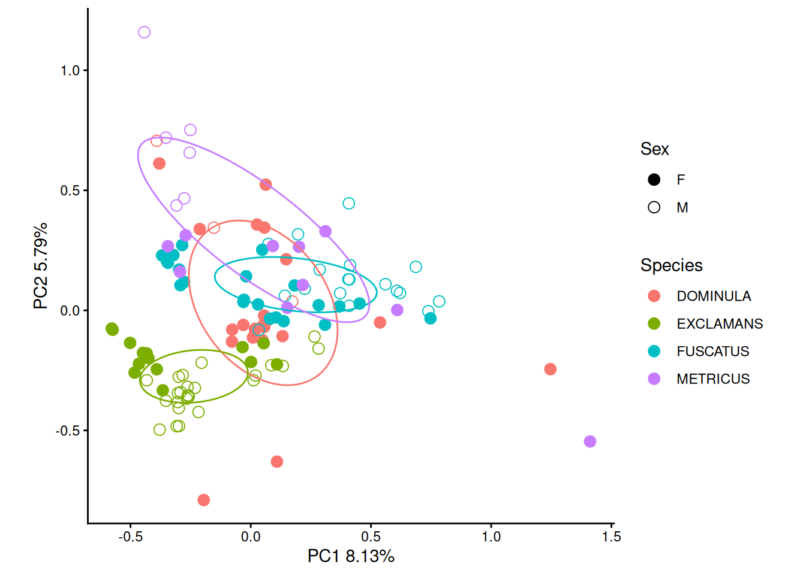

Principal componenets analysis shows decent separation between species,
with *P. dominula*, *P. fuscatus* and *P. dominula* separating along PC2
and *P. exclamans* separating from the other species along PC1.

We can get even better separation if we break down our data by sex,
though there is considerable intraspecific variation.

``` r

cond <- which(pktab$sample_meta$SEX == "M")
ord_m <- vegan::rda(pktab$tab[cond,], scale = TRUE)

p_male <- gg_ordiplot(ord_m, groups = pktab$sample_meta[cond, "POLISTES_SPECIES"], 
            plot = FALSE)$plot + 
  ggtitle("Males") +
  theme_classic() +
  theme(legend.position = "bottom", plot.title = element_text(hjust = 0.5)) +
  labs(colour = "Species")

cond <- which(pktab$sample_meta$SEX == "F")
ord_f <- vegan::rda(pktab$tab[cond,],scale=TRUE)

p_female <- gg_ordiplot(ord_f, groups = pktab$sample_meta[cond,"POLISTES_SPECIES"],
                         plot = FALSE)$plot + 
  ggtitle("Females") + 
  theme_classic() +
  theme(legend.position = "bottom", plot.title = element_text(hjust = 0.5)) +
  labs(colour = "Species")

p_male
```

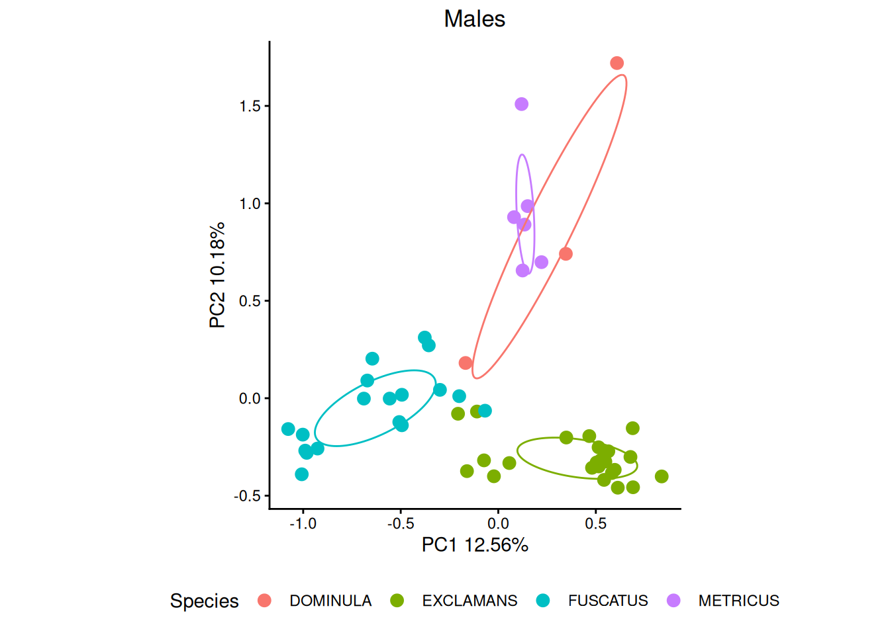

``` r

p_female
```

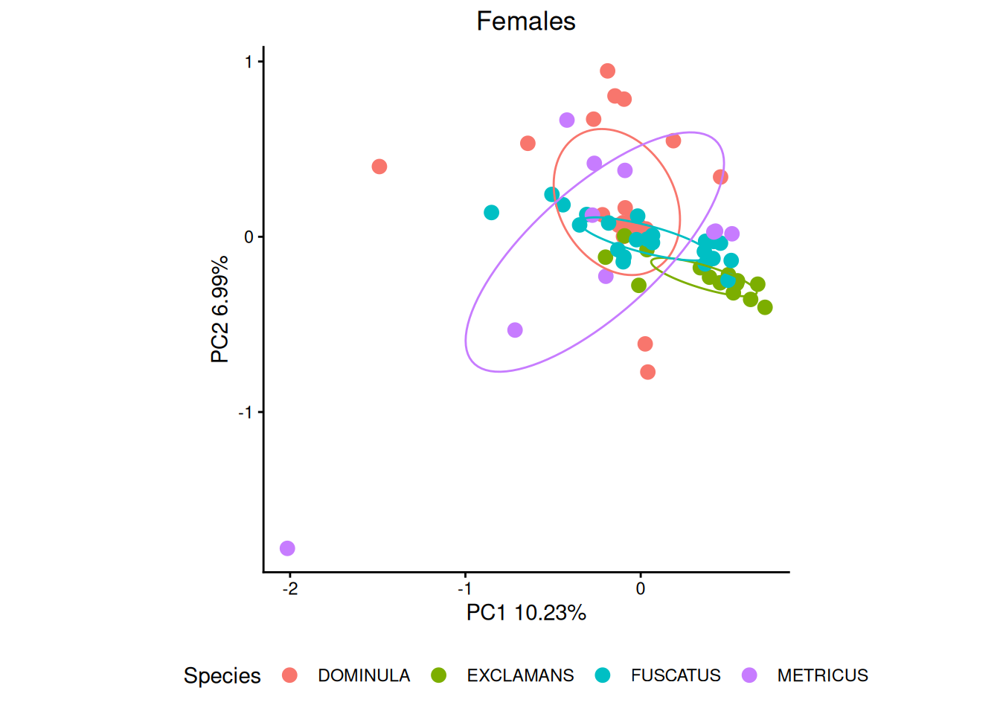

### References

Bruschini, Claudia, Rita Cervo, Alessandro Cini, et al. 2011. “Cuticular
Hydrocarbons Rather Than Peptides Are Responsible for Nestmate
Recognition in Polistes Dominulus.” *Chemical Senses* 36 (8): 715–23.
<https://doi.org/10.1093/chemse/bjr042>.

Cook, Bruce. 2022. “Northern Paper Wasp (Polistes Fuscatus).”
iNaturalist; iNaturalist, August 20.
<https://www.inaturalist.org/observations/131629083>.

Drabik-Hamshare, Martyn. 2022. “Metric Paper Wasp (Polistes Metricus).”
iNaturalist; iNaturalist, August 23.
<https://www.inaturalist.org/observations/132080545>.

Gamboa, G. J., H. K. Reeve, and D. W. Pfennig. 1986. “The Evolution and
Ontogeny of Nestmate Recognition in Social Wasps.” *Annual Review of
Entomology* 31 (January): 431–54.
<https://doi.org/10.1146/annurev.en.31.010186.002243>.

Gamboa, George J., Thaddeus A. Grudzien, Karl E. Espelie, and Elizabeth
A. Bura. 1996. “Kin Recognition Pheromones in Social Wasps: Combining
Chemical and Behavioural Evidence.” *Animal Behaviour* 51 (3): 625–29.
<https://doi.org/10.1006/anbe.1996.0067>.

Jandt, J. M., E. A. Tibbetts, and A. L. Toth. 2014. “Polistes Paper
Wasps: A Model Genus for the Study of Social Dominance Hierarchies.”
*Insectes Sociaux* 61 (1): 11–27.
<https://doi.org/10.1007/s00040-013-0328-0>.

Kranz, Adam. 2020. “European Paper Wasp (Polistes Dominula).”
iNaturalist; iNaturalist, July 29.
<https://www.inaturalist.org/observations/54801686>.

Legan, Andrew W. 2022. *Molecular and Chemical Basis of Social Olfaction
in Polistes Paper Wasps*. <https://doi.org/10.7298/CZ0P-6J74>.

Legan, Andrew W, Christopher M Jernigan, Sara E Miller, Matthieu F
Fuchs, and Michael J Sheehan. 2021. “Expansion and Accelerated Evolution
of 9-Exon Odorant Receptors in Polistes Paper Wasps.” *Molecular Biology
and Evolution* 38 (9): 3832–46.
<https://doi.org/10.1093/molbev/msab023>.

Legan, Andrew, Arthur Chen, Matthieu Fuchs, and Michael Sheehan. 2022.
“119 Chromatograms (GC-FID) of the Cuticular Hydrocarbons of Four
Polistes Paper Wasp Species (Hymenoptera: Vespidae: Polistinae).”
Version 3. Dryad, November 29.
<https://doi.org/10.5061/DRYAD.WPZGMSBR8>.

Reed, H. C., and P. J. Landolt. 1990. “Sex Attraction in Paper
Wasp,Polistes Exclamans Viereck (Hymenoptera: Vespidae), in a Wind
Tunnel.” *Journal of Chemical Ecology* 16 (4): 1277–87.
<https://doi.org/10.1007/BF01021026>.

### Session Information

``` r

sessionInfo()
#> R version 4.6.1 (2026-06-24)
#> Platform: x86_64-pc-linux-gnu
#> Running under: Ubuntu 24.04.4 LTS
#> 
#> Matrix products: default
#> BLAS:   /usr/lib/x86_64-linux-gnu/openblas-pthread/libblas.so.3 
#> LAPACK: /usr/lib/x86_64-linux-gnu/openblas-pthread/libopenblasp-r0.3.26.so;  LAPACK version 3.12.0
#> 
#> locale:
#>  [1] LC_CTYPE=C.UTF-8       LC_NUMERIC=C           LC_TIME=C.UTF-8       
#>  [4] LC_COLLATE=C.UTF-8     LC_MONETARY=C.UTF-8    LC_MESSAGES=C.UTF-8   
#>  [7] LC_PAPER=C.UTF-8       LC_NAME=C              LC_ADDRESS=C          
#> [10] LC_TELEPHONE=C         LC_MEASUREMENT=C.UTF-8 LC_IDENTIFICATION=C   
#> 
#> time zone: UTC
#> tzcode source: system (glibc)
#> 
#> attached base packages:
#> [1] stats     graphics  grDevices utils     datasets  methods   base     
#> 
#> other attached packages:
#> [1] ggplot2_4.0.3        vegan_2.7-6          permute_0.9-10      
#> [4] rdryad_1.0.0         chromatographR_0.8.0
#> 
#> loaded via a namespace (and not attached):
#>  [1] gtable_0.3.6          xfun_0.60             caTools_1.18.4       
#>  [4] lattice_0.22-9        generics_0.1.4        vctrs_0.7.3          
#>  [7] tools_4.6.1           bitops_1.1-0          curl_8.0.0           
#> [10] parallel_4.6.1        tibble_3.3.1          cluster_2.1.8.2      
#> [13] pkgconfig_2.0.3       Matrix_1.7-5          data.table_1.18.6.1  
#> [16] RColorBrewer_1.1-3    S7_0.2.2              readxl_1.5.0         
#> [19] lifecycle_1.0.5       compiler_4.6.1        farver_2.1.2         
#> [22] stringr_1.6.0         ptw_1.9-17            RcppDE_0.1.9         
#> [25] minpack.lm_1.2-4      htmltools_0.5.9       yaml_2.3.12          
#> [28] Formula_1.2-6         pillar_1.11.1         MASS_7.3-65          
#> [31] RaMS_1.4.3            nlme_3.1-169          mime_0.13            
#> [34] tidyselect_1.2.1      zip_3.0.2             digest_0.6.39        
#> [37] stringi_1.8.9         dplyr_1.2.1           purrr_1.2.2          
#> [40] labeling_0.4.3        VPdtw_2.2.1           splines_4.6.1        
#> [43] rprojroot_2.1.1       fastmap_1.2.0         grid_4.6.1           
#> [46] here_1.0.2            cli_3.6.6             chromConverter_0.9.0 
#> [49] magrittr_2.0.5        base64enc_0.1-6       crul_1.6.0           
#> [52] dynamicTreeCut_1.63-1 withr_3.0.3           ggordiplots_0.4.3    
#> [55] scales_1.4.0          rappdirs_0.3.4        bit64_4.8.4          
#> [58] rmarkdown_2.31        bit_4.6.0             otel_0.2.0           
#> [61] reticulate_1.46.0     cellranger_1.1.0      fastcluster_1.3.0    
#> [64] png_0.1-9             pbapply_1.7-4         evaluate_1.0.5       
#> [67] knitr_1.51            hoardr_0.5.5          mgcv_1.9-4           
#> [70] rlang_1.3.0           Rcpp_1.1.2            glue_1.8.1           
#> [73] httpcode_0.3.0        xml2_1.6.0            jsonlite_2.0.0       
#> [76] R6_2.6.1
```
