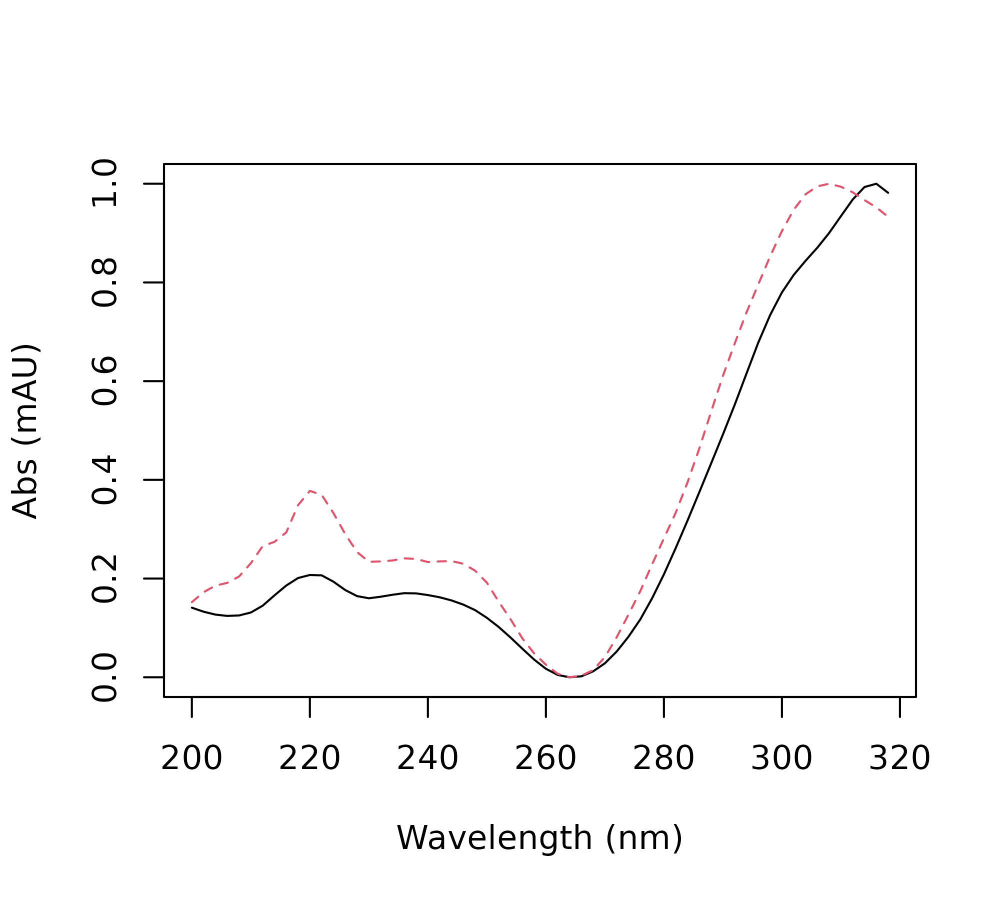
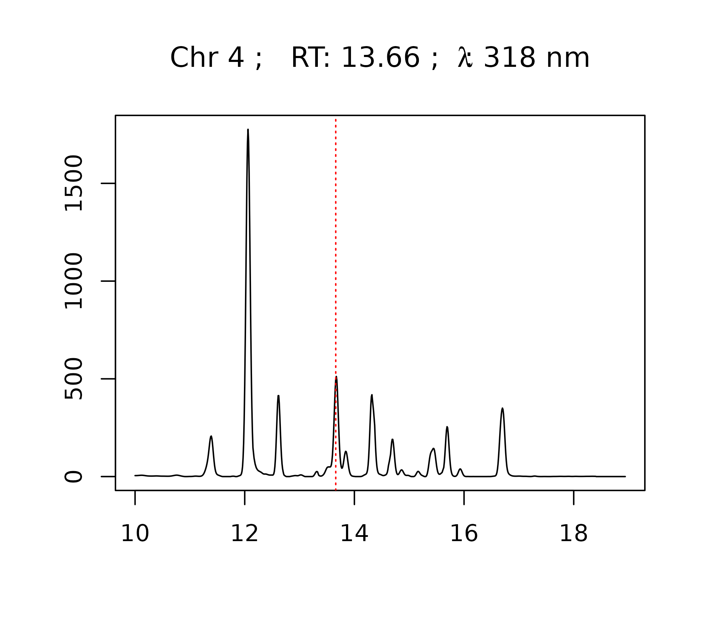

# chromatographR: An introduction to HPLC-DAD analysis

¹ Department of Ecology and Evolutionary Biology, Cornell University,
Ithaca NY

## Introduction

*chromatographR* is a package for the reproducible analysis of HPLC-DAD
data in `R`. Liquid chromatography coupled to diode-array detection
(HPLC-DAD) remains one of the most popular analytical methodologies due
to its convenience and low-cost. However, there are currently very few
open-source tools available for analyzing HPLC-DAD chromatograms or
other “simple” chromatographic data. The use of proprietary software for
the analysis of HPLC-DAD data is currently a significant barrier to
reproducible science, since these tools are not widely accessible, and
usually require users to select complicated options through a graphical
user interface which cannot easily be repeated. Reproducibility is much
higher in command line workflows, like *chromatographR*, where the
entire analysis can be stored and easily repeated by anyone using
publicly available software.

The *chromatographR* package began as a fork from the previously
published *alsace* package (Wehrens, Carvalho, and Fraser 2015), but has
been reworked with improved functions for peak-finding, integration and
peak table generation as well as a number of new tools for data
visualization and downstream analysis. Unlike *alsace*, which emphasized
multivariate curve resolution through alternating least squares
(MCR-ALS), *chromatographR* is developed around a more conventional
workflow that should seem more familiar to users of standard software
tools for HPLC-DAD analysis. *chromatographR* includes tools for a)
pre-processing, b) retention-time alignment, c) peak-finding, d)
peak-integration and e) peak-table construction, as well as additional
functions useful for analyzing the resulting peak table.

## Workflow

### Loading data

chromatographR can import data from a growing list of proprietary file
formats using the `read_chroms` function. Supported file formats include
‘Agilent ChemStation’ and ‘MassHunter’ (`.D`) files, ‘Thermo Raw’
(`.raw`), ‘Chromeleon’ UV ASCII (`.txt`), ‘Waters ARW’ (`.arw`),
‘Shimadzu’ ASCII (`.txt`), and more. (For a full list, see the
[chromConverter
documentation](https://ethanbass.github.io/chromConverter/)). Select the
appropriate file format by specifying the `format_in` argument
(e.g. `csv`, `chemstation_uv`, `masshunter_dad`, `chromeleon_uv`,
`waters_arw`, etc).

``` text
> # single folder
> read_chroms(paths = path, format_in = "chemstation_uv")
> 
> # multiple folders
> path <- 'foo' # path to parent directory
> folders <- list.files(path = path, full.names = TRUE)
> dat <- read_chroms(folders, format_in = "chemstation_uv")
```

### Example data

The package includes some example data consisting of root extracts from
tall goldenrod (*Solidago altissima*). Roots were extracted in 90%
methanol and run on an Agilent 1100 HPLC coupled to a DAD detector,
according to a previously described method (Uesugi and Kessler 2013).
The dataset is called `Sa` (abbreviated from *Solidago altissima*).

``` text
> data(Sa)
```

### Pre-processing data

Data from liquid chromatography often suffer from a variety of
non-informative artifacts, such as noise or a drifting baseline. In
addition, the data produced by the instrument may have a higher
resolution or wider range (along either the time or spectral dimensions)
than we require. Fortunately, most of these issues can be remedied
fairly easily. For example, smoothing can reduce noise in the spectral
direction while baseline subtraction can help correct a drifting
baseline. Interpolation of wavelengths and retention times can be used
to reduce the dimensionality of the data, facilitating comparison across
samples and reducing the time and computational load required by
downstream analyses. All of these functions (smoothing, baseline
correction, and interpolation) are available through the `preprocess`
function and are enabled by default.

To select a narrower range of times and/or wavelengths, arguments can be
provided to the optional `dim1` and `dim2` arguments. The `baseline_cor`
function from the *ptw* package (Bloemberg et al. 2010) takes arguments
`p` (an asymmetry parameter) and `lambda` (a smoothing parameter). You
can read more about these in the documentation for
[`ptw::asysm`](https://rdrr.io/pkg/ptw/man/asysm.html). You may want to
experiment with these parameters before choosing values to use on your
whole dataset.

``` text
> i <- 2 # chromatogram number in list of data
> tpoints <- as.numeric(rownames(Sa[[i]]))
> lambda <- '200.00000'
> 
> matplot(x = tpoints, y = Sa[[i]][,lambda],
+        type = 'l', ylab = 'Abs (mAU)', xlab = 'Time (min)')
> matplot(x = tpoints, y = ptw::baseline.corr(Sa[[i]][,lambda], p = .001, lambda = 1e5),
+        type = 'l', add = TRUE, col='darkgreen', lty = 3)
> matplot(x = tpoints, y = ptw::baseline.corr(Sa[[i]][,lambda], p = .1, lambda = 1e5),
+        type = 'l', add = TRUE, col='firebrick2', lty = 3)
```


Comparison of baseline correction parameters: raw data (black), mild
correction (green, p = 0.001), strong correction (red, p = 0.1).

After selecting parameters for baseline correction, you can proceed with
the pre-processing step as shown below.

``` text
> # choose dimensions for interpolation
> new.ts <- seq(10, 18.66, by = .01) # choose time-points
> new.lambdas <- seq(200, 318, by = 2) # choose wavelengths
> 
> dat.pr <- preprocess(Sa, dim1 = new.ts, dim2 = new.lambdas, p = .001, 
+                      lambda = 1e5, cl = 1)
```

### Alignment

In many cases, liquid chromatography can suffer from retention time
shifts (e.g. due to temperature fluctuations, column degradation, or
subtle changes in mobile-phase composition), which can make it very
difficult to compare peaks across samples. Luckily, a number of
“time-warping” algorithms have been developed for correcting these kinds
of shifts. In `chromatographR`, parametric time warping (`ptw`) (Eilers
2004; Bloemberg et al. 2010) and variable penalty dynamic time warping
(`vpdtw`) (Clifford et al. 2009; Clifford and Stone 2012) are available
for correcting retention time shifts through the `correct_rt` function.
Both warping functions aim to produce a better alignment of features by
“warping” the time-axis of each supplied chromatogram to match a
reference chromatogram. (The reference chromatogram can either be
determined algorithmically or selected manually by setting the
`reference` argument).

First, we check the alignment of our chromatograms using the
`plot_chroms` function.

``` text
> plot_chroms(dat.pr, lambdas = 210)
```


Chromatographic traces of four *S. altissima* root chromatograms at 210
nm.

Our chromatograms appear to be shifted, as shown by the poor overlap of
the chromatograms across our four samples. To remedy this problem, we
can try to “warp” our chromatograms using one of the two options
described above.

#### Parametric time warping

The `ptw` option can take a single wavelength or a list of wavelengths
provided by the user using the `lambdas` argument. For each
chromatogram, `ptw` then produces a “global” warping function across all
the wavelengths supplied by the user. The code block below creates
warping models for the samples in the provided list of data matrices.
The same function is then used to warp each chromatogram according to
the corresponding model, by setting the `models` parameter. Depending on
the variety of your samples and the severity of the retention time
shifts, it may take some experimentation with the warping parameters to
get satisfactory results. Sometimes less can actually be more here – for
example, wavelengths with fewer peaks may sometimes yield better warping
models. (Also see the documentation for
[ptw](https://CRAN.R-project.org/package=ptw) for more guidance on warp
function optimization).

``` text
> warping.models <- correct_rt(dat.pr, alg = "ptw", what = "models", lambdas = 210, scale = TRUE)
> warp_ptw <- correct_rt(chrom_list = dat.pr, models = warping.models, what = "corrected.values")
```

We can then use the following code snippet to compare the alignment of
warped (top panel) and unwarped (bottom panel) chromatograms.

``` text
> par(mfrow=c(2,1))
> plot_chroms(dat.pr, lambdas = 210, show_legend = FALSE)
> legend("topleft", legend = "Raw data", bty = "n")
> 
> plot_chroms(warp_ptw, lambdas = 210, show_legend = FALSE)
> legend("topleft", legend = "PTW", bty = "n")
```


Comparison of parametric time warping (PTW) aligned chromatograms and
raw data.

Clearly, the alignment is considerably improved after warping. You can
also use the `correct_rt` function to do a global alignment on multiple
wavelengths, by providing a list of wavelengths to the `lambdas`
argument, but this will not always improve the results. While the
alignment still isn’t perfect after warping, it is probably good enough
to align our peaks and assemble them in the peak table, which is our
primary goal.

#### Variable penalty dynamic time warping

Variable penalty dynamic time warping is another algorithm that can be
very effective for correcting retention time shifts (Clifford et al.
2009; Clifford and Stone 2012). Instead of calculating an explicit
warping function, dynamic time warping (DTW) works by repeatedly
shifting, expanding or contracting the time axis in small steps until a
satisfactory alignment is attained. This process can result in very
close matching of peaks, but can also lead to severe peak distortion if
the time axis is repeatedly expanded and/or contracted (Tomasi, van den
Berg, and Andersson 2004). **Variable penalty dynamic time warping** is
a derivative of DTW that constrains expansion and contraction of the
time-axis by applying a penalty to these types of “risky” moves. This
can often achieve a very good alignment with minimal peak distortion.
VPdtw package is a suggested dependency since it requires a working C++
compiler. Unlike `PTW`, `VPdtw` can only take a single wavelength as
input (but it returns a global warping on the whole chromatographic
matrix). The code snippet below uses VPdtw to warp the example
chromatograms using the first chromatogram as a reference. The `penalty`
and `maxshift` parameters can be adjusted to control the degree of
warping.

``` text
> warp_vpdtw <- correct_rt(chrom_list = dat.pr, alg = "vpdtw", lambdas = 210, 
+                    what = "corrected.values")
```

``` text
> par(mfrow=c(2,1))
> plot_chroms(dat.pr, lambdas = 210, show_legend = FALSE)
> legend("topleft", legend = "Raw data", bty = "n")
> 
> plot_chroms(warp_vpdtw, lambdas = 210, show_legend = FALSE)
> legend("topleft", legend = "VPdtw", bty = "n")
```


Comparison of variable penalty dynamic time warping (VPdtw) aligned
chromatograms (top) with raw data (bottom).

Chromatograms can also be visualized as heatmaps with
`plot_chroms_heatmap`, which can be a powerful way to check the
alignment of chromatograms across samples.

``` text
> par(mfrow=c(3,1))
> plot_chroms_heatmap(dat.pr, lambdas = 210, show_legend = FALSE, title="Raw data")
> plot_chroms_heatmap(warp_ptw, lambdas = 210, show_legend = FALSE, title="Parametric Time Warping (PTW)")
> plot_chroms_heatmap(warp_vpdtw, lambdas = 210, show_legend = FALSE, title="Variable Penalty Dynamic Time Warping (VPdtw)")
```


Comparison of variable penalty dynamic time warping (VPdtw) aligned
chromatograms (top) with raw data (bottom) via heatmap plot.

In this case the alignments produced by the two algorithms are quite
similar, but in other cases one algorithm may dramatically outperform
the other. In my experience, alignments generated by VPdtw are less
prone to overfitting. However, the PTW algorithm is more interpretable
since it fits an explicit model to the data. Examination of the
coefficients from these models can often be useful for the
identification of problematic samples.

### Peak detection and integration

The `get_peaks` function produced a nested list of peaks by looping
through the supplied chromatograms at the specified wavelengths, finding
peaks, and fitting them to the specified function using non-linear least
squares. The area under the curve for each peak is then estimated using
trapezoidal approximation. The `fit` argument can be used to specify a
peak-fitting model. The current options are exponential-gaussian hybrid
(`egh`) (Lan and Jorgenson 2001) (the default setting) or `gaussian`.
Alternatively, peak areas can be integrated without applying a model
(`fit = raw`). The function returns a nested list of data.frames
containing parameters for the peaks identified in each chromatogram.

``` text
> # find and integrate peaks using gaussian peak fitting
> pks_gauss <- get_peaks(warp_vpdtw, lambdas = c(210), sd.max = 40, fit = "gaussian")
> 
> # find and integrate peaks using exponential-gaussian hybrid model
> pks_egh <- get_peaks(warp_vpdtw, lambdas = c(210), sd.max = 40, fit = "egh")
> 
> # find and integrate peaks without modeling peak shape
> pks_raw <- get_peaks(warp_vpdtw, lambdas = c(210), sd.max = 100, fit = "raw")
```

#### Filtering

The peak-finding algorithm may often detect a lot of peaks that are
little more than noise. Thus, it is recommended to filter out extraneous
peaks at this stage (especially if you are processing a lot of samples)
as it can greatly reduce the computational burden of peak table
construction. This can be accomplished directly by using the arguments
`sd_max` (to filter by peak width) and/or `amp_thresh` (to filter by
peak height). Alternatively, the `filter_peaks` function can be used to
filter peaks after the `peak_list` has already been created.

#### Visualization

The `plot.peak_list` function allows you to visually assess the peak
integration accuracy. Below we compare the peaks fitted for the first
chromatogram (`idx = 1`) using the two algorithms. Usually the egh
function performs slightly better for asymmetrical peaks. Even though
the peaks are fully filled in when the `raw` setting is selected, the
results may not necessarily be more accurate.

``` text
> par(mfrow=c(3,1))
> plot(pks_gauss, idx = 1, lambda = 210)
> legend("topright", "Gaussian", bty = "n")
> 
> plot(pks_egh, idx = 1, lambda = 210)
> legend("topright", "Exponential-gaussian hybrid", bty = "n")
> 
> plot(pks_raw, idx = 1, lambda = 210)
> legend("topright", "Raw", bty = "n")
```


Comparison of peak fitting algorithms: gaussian (top),
exponential-gaussian hybrid (middle) and raw (bottom).

### Peak table assembly

After obtaining a `peak_list`, the `get_peaks` function performs
complete-linkage hierarchical clustering to link peaks across samples.
It returns a `peak_table` object with samples as rows and peaks as
columns. The `peak_table` object also has slots for holding metadata
about peaks, samples, and the parameters used in the analysis. If you
have a lot of samples, this step can be quite computationally expensive.
Thus, it is suggested to filter the peak_list provided to
`get_peaktable` in order to remove extraneous peaks (see *Peak finding
and fitting* section above). Peaks can also be filtered after
`peak_table` assembly using the `filter_peaktable` function. An
important parameter here is `hmax` which controls the stringency with
which retention times are matched across samples. A low value of `hmax`
will increase the odds of splitting a single peaks across multiple
columns, while a high value of `hmax` will increase the odds of
erroneously combining multiple peaks into the same column.

``` text
> # assembly peak table from peak_list saved in `pks_egh`
> pk_tab <- get_peaktable(pks_egh, response = "area", hmax = 0.2)
> 
> # print first six columns of peak table
> head(pk_tab$tab[,1:6])
```

              V1       V2        V3        V4       V5        V6
    119 0.000000 5.496455 0.0000000 0.6572183 1.991365 15.199917
    121 6.067418 4.200859 1.0746359 0.6078366 0.000000  7.908693
    122 4.033380 8.261218 0.9544689 1.9510595 0.000000 25.772683
    458 6.545535 6.201729 2.2880101 1.9889770 5.308515 13.995000

### Further analysis and data-visualization

#### Attaching metadata

To begin analyzing your peak table, you will usually want to attach
sample metadata to the `peak_table` object. This can be easily
accomplished using the `attach_metadata` function. This function takes a
`metadata` argument which should be supplied with a `data.frame`
containing experimental metadata, where one of the columns matches the
names of your samples. This column should be specified by supplying the
column name as a string to the `column` argument. This will attach the
ordered metadata in the `sample_meta` slot of your peak table. The peak
table can then be normalized (e.g. by dividing out the sample weight)
using the `normalize_data` function.

``` text
> # load example metadata
> path <- system.file("extdata", "Sa_metadata.csv", package = "chromatographR")
> meta <- read.csv(path)
> # attach metadata
> pk_tab <- attach_metadata(peak_table = pk_tab, metadata = meta, column = "vial")
> # normalize peak table by sample mass
> pk_tab <- normalize_data(peak_table = pk_tab, column = "mass")
```

#### Attaching reference spectra

Optionally, you can attach scaled reference spectra to the peak_table
using the `attach_ref_spectra` function. This can be helpful for working
with UV spectra programmatically (e.g. to sort peaks by their
chromophores). Reference spectra are defined either as the spectrum with
the highest intensity for each peak (when `ref = "max.int"`) or as the
spectrum with the highest average correlation to the other spectra
associated with the peak (when `ref = "max.cor"`). Below, we show how
these spectra can be used to construct a correlation matrix to find
peaks matching a particular chromophore.

``` text
> pk_tab <- attach_ref_spectra(pk_tab, ref = "max.int")
> cor_matrix <- cor(pk_tab$ref_spectra)
> hx <- names(which(cor_matrix[,"V20"] > .97))
> matplot(x = as.numeric(rownames(pk_tab$ref_spectra)),
+                    y = pk_tab$ref_spectra[, hx], type = 'l',
+                    ylab = "Abs (mAU)", 
+                    xlab = "Wavelength (nm)")
```



#### Data visualization

##### Mirror plot

The `mirror_plot` function provides a quick way to visually compare
results across treatment groups.

``` text
> mirror_plot(pk_tab, lambdas = c(210), var = "trt", legend_size = 2)
```


##### Plotting spectra

The `plot_spectrum` function allows you to easily plot or record the
spectra associated with a particular peak in your peak table. This is
useful for interpreting your results and/or checking for errors in your
peak table. For example, you may want to check if the spectra for a
particular peak match across different samples, or you may want to
compare your spectrum with a known standard. The `plot_spectrum`
function can be used to plot only the spectrum or only the
chromatographic trace using the arguments `plot_spectrum` and
`plot_trace`. By default it will plot the trace and spectrum from the
chromatogram with the largest peak in the peak table. Alternatively, you
can choose the chromatogram index and wavelength using the `idx` and
`lambda` arguments.

``` text
> par(mfrow = c(2,1))
> peak <- "V7"
> plot_spectrum(peak, peak_table = pk_tab, chrom_list = warp_vpdtw, 
+               verbose = FALSE)
```


The `plot_spectrum` function can also be used to generate interactive
plots using [plotly](https://plotly.com/r/).

``` text
> plot_spectrum(peak, peak_table = pk_tab, chrom_list = warp_vpdtw, 
+               verbose = FALSE, engine = "plotly")
```

The `plot_all_spectra` function can be used to visually compare the
spectra for a specified peak across all samples.

``` text
> peak <- "V13"
> plot_all_spectra(peak, peak_table = pk_tab, export = FALSE)
```


##### Plot peak table function

The `plot.peak_table` function provides a simplified interface to
various options for plotting data from the `peak_table`. For example, it
can be used as a quick interface to the `plot_spectrum` and
`plot_all_spectra` functions shown above. It can also be used to quickly
compare results across treatments by calling `boxplot`.

``` text
> par(mfrow = c(3,1))
> plot(pk_tab, loc = "V13", box_plot = TRUE, vars = "trt", verbose = FALSE)
```



## References

Bloemberg, Tom G., Jan Gerretzen, Hans J. P. Wouters, Jolein Gloerich,
Maurice van Dael, Hans J. C. T. Wessels, Lambert P. van den Heuvel, Paul
H. C. Eilers, Lutgarde M. C. Buydens, and Ron Wehrens. 2010. “Improved
Parametric Time Warping for Proteomics.” *Chemometrics and Intelligent
Laboratory Systems*, OMICS, 104 (1): 65–74.
<https://doi.org/10.1016/j.chemolab.2010.04.008>.

Clifford, David, and Glenn Stone. 2012. “Variable Penalty Dynamic Time
Warping Code for Aligning Mass Spectrometry Chromatograms in R.”
*Journal of Statistical Software* 47 (April): 1–17.
<https://doi.org/10.18637/jss.v047.i08>.

Clifford, David, Glenn Stone, Ivan Montoliu, Serge Rezzi,
François-Pierre Martin, Philippe Guy, Stephen Bruce, and Sunil Kochhar.
2009. “Alignment Using Variable Penalty Dynamic Time Warping.”
*Analytical Chemistry* 81 (3): 1000–1007.
<https://doi.org/10.1021/ac802041e>.

Eilers, Paul H. C. 2004. “Parametric Time Warping.” *Analytical
Chemistry* 76 (2): 404–11. <https://doi.org/10.1021/ac034800e>.

Lan, Kevin, and James W. Jorgenson. 2001. “A Hybrid of Exponential and
Gaussian Functions as a Simple Model of Asymmetric Chromatographic
Peaks.” *Journal of Chromatography A* 915 (1): 1–13.
<https://doi.org/10.1016/S0021-9673(01)00594-5>.

Tomasi, Giorgio, Frans van den Berg, and Claus Andersson. 2004.
“Correlation Optimized Warping and Dynamic Time Warping as Preprocessing
Methods for Chromatographic Data.” *Journal of Chemometrics* 18 (5):
231–41. <https://doi.org/10.1002/cem.859>.

Uesugi, Akane, and André Kessler. 2013. “Herbivore Exclusion Drives the
Evolution of Plant Competitiveness via Increased Allelopathy.” *New
Phytologist* 198 (3): 916–24. <https://doi.org/10.1111/nph.12172>.

Wehrens, Ron, Elisabete Carvalho, and Paul D. Fraser. 2015. “Metabolite
Profiling in LC-DAD Using Multivariate Curve Resolution: The Alsace
Package for R.” *Metabolomics* 11 (1): 143–54.
<https://doi.org/10.1007/s11306-014-0683-5>.

## Session Information

``` text
> sessionInfo()
```

    R version 4.5.2 (2025-10-31)
    Platform: x86_64-pc-linux-gnu
    Running under: Ubuntu 24.04.3 LTS

    Matrix products: default
    BLAS:   /usr/lib/x86_64-linux-gnu/openblas-pthread/libblas.so.3 
    LAPACK: /usr/lib/x86_64-linux-gnu/openblas-pthread/libopenblasp-r0.3.26.so;  LAPACK version 3.12.0

    locale:
     [1] LC_CTYPE=C.UTF-8       LC_NUMERIC=C           LC_TIME=C.UTF-8       
     [4] LC_COLLATE=C.UTF-8     LC_MONETARY=C.UTF-8    LC_MESSAGES=C.UTF-8   
     [7] LC_PAPER=C.UTF-8       LC_NAME=C              LC_ADDRESS=C          
    [10] LC_TELEPHONE=C         LC_MEASUREMENT=C.UTF-8 LC_IDENTIFICATION=C   

    time zone: UTC
    tzcode source: system (glibc)

    attached base packages:
    [1] parallel  stats     graphics  grDevices utils     datasets  methods  
    [8] base     

    other attached packages:
    [1] chromatographR_0.7.5 knitr_1.51          

    loaded via a namespace (and not attached):
     [1] sass_0.4.10           bitops_1.0-9          xml2_1.5.2           
     [4] fastcluster_1.3.0     stringi_1.8.7         lattice_0.22-7       
     [7] digest_0.6.39         magrittr_2.0.4        caTools_1.18.3       
    [10] chromConverter_0.7.5  RColorBrewer_1.1-3    evaluate_1.0.5       
    [13] grid_4.5.2            dynamicTreeCut_1.63-1 fastmap_1.2.0        
    [16] cellranger_1.1.0      jsonlite_2.0.0        Matrix_1.7-4         
    [19] Formula_1.2-5         purrr_1.2.1           scales_1.4.0         
    [22] RaMS_1.4.3            pbapply_1.7-4         textshaping_1.0.4    
    [25] jquerylib_0.1.4       cli_3.6.5             rlang_1.1.7          
    [28] bit64_4.6.0-1         ptw_1.9-17            base64enc_0.1-6      
    [31] cachem_1.1.0          yaml_2.3.12           otel_0.2.0           
    [34] tools_4.5.2           minpack.lm_1.2-4      RcppDE_0.1.8         
    [37] reticulate_1.45.0     vctrs_0.7.1           R6_2.6.1             
    [40] png_0.1-8             lifecycle_1.0.5       stringr_1.6.0        
    [43] fs_1.6.6              htmlwidgets_1.6.4     bit_4.6.0            
    [46] ragg_1.5.0            desc_1.4.3            pkgdown_2.2.0.9000   
    [49] bslib_0.10.0          VPdtw_2.2.1           data.table_1.18.2.1  
    [52] glue_1.8.0            Rcpp_1.1.1            systemfonts_1.3.1    
    [55] xfun_0.56             farver_2.1.2          htmltools_0.5.9      
    [58] rmarkdown_2.30        compiler_4.5.2        readxl_1.4.5         
