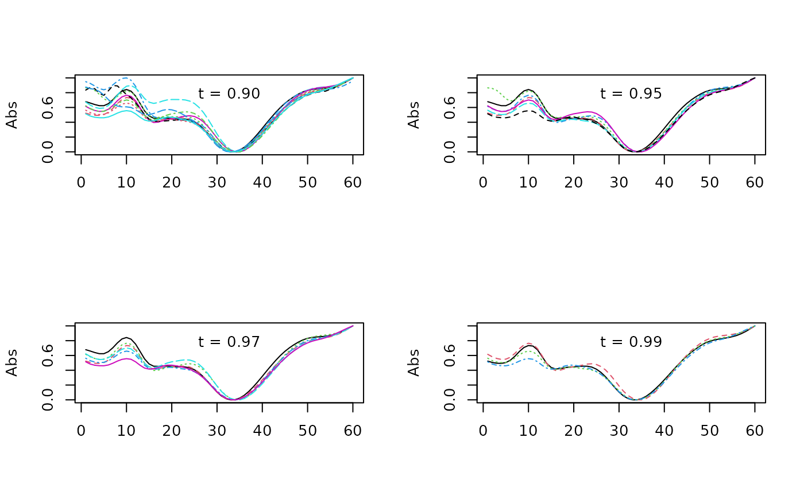
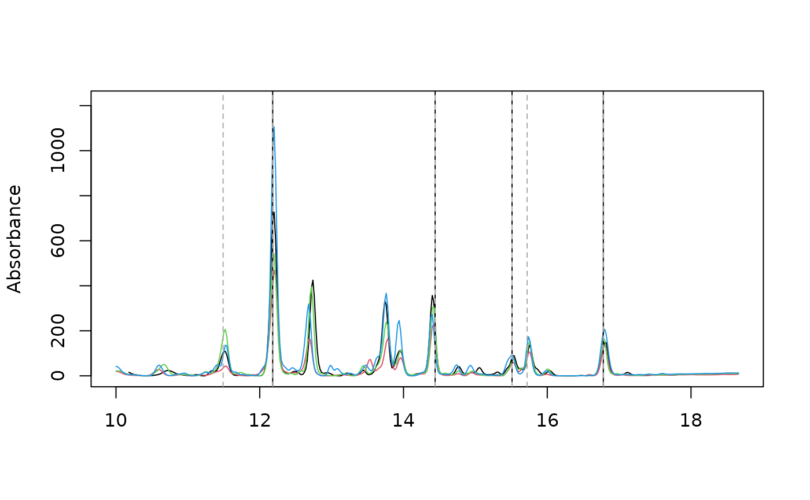
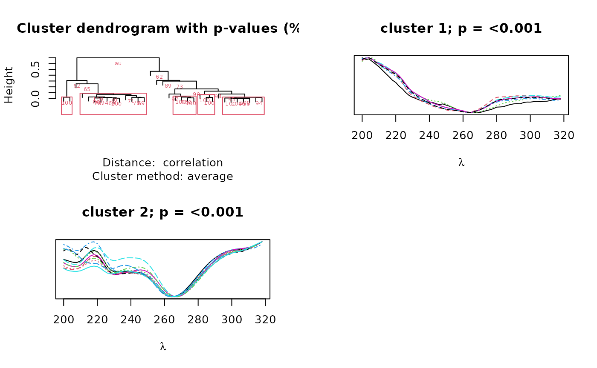

# Programmatic analysis of UV spectra

``` r

library(chromatographR)
data("Sa_warp")
```

``` r

pks <- get_peaks(Sa_warp, lambdas = 210)
pktab <- get_peaktable(pks)
```

``` r

pktab <- attach_ref_spectra(pktab, ref = "max.cor")
```

After assigning reference spectra to our peak table, we can use pearson
correlations to easily locate peaks falling within a certain similarity
threshold to a reference spectrum. To do this, we must first construct a
correlation matrix using the `cor` function.

##### Analysis of spectral correlations

``` r

cor_mat <- cor(pktab$ref_spectra)
```

We can then plot spectra falling within a desired similarity threshold
(`t`) to a reference peak (in this case ‘V21’).

``` r

par(mfrow=c(2,2))
idx_90 <- which(cor_mat[,"V21"] > .9)
matplot(pktab$ref_spectra[,idx_90],type='l', ylab="Abs")
legend("top", "t = 0.90", bty = "n")

idx_95 <- which(cor_mat[,"V21"] > .95)
matplot(pktab$ref_spectra[,idx_95],type='l', ylab="Abs")
legend("top", "t = 0.95", bty = "n")

idx_97 <- which(cor_mat[,"V21"] > .97)
matplot(pktab$ref_spectra[,idx_97],type='l', ylab="Abs")
legend("top", "t = 0.97", bty = "n")

idx_99 <- which(cor_mat[,"V21"] > .99)
matplot(pktab$ref_spectra[,idx_99],type='l', ylab="Abs")
legend("top", "t = 0.99", bty = "n")
```



We can also extract retention times for spectra above the desired
spectral similarity threshold with the reference spectra.

``` r

rts_99 = pktab$pk_meta["rt", idx_99]
rts_99
#>       V9   V17   V21   V26
#> rt 12.18 14.44 15.51 16.78
```

Below we plot traces of our four chromatograms at 210 nm. The 4 peaks
that match the reference spectrum at the 99% level are marked with solid
black lines and the 6 peaks that match the reference spectrum at the 97%
level are marked with dotted gray lines.

``` r

par(mfrow = c(1, 1))
plot_chroms(Sa_warp, lambdas=210)

abline(v = rts_99)
abline(v = pktab$pk_meta["rt", idx_97], lty=2, col = "darkgray")
```



If we are interested in the combined area of these peaks, we could also
use these indices to sum them together.

``` r

apply(pktab$tab[,idx_99], 1, sum)
#>      119      121      122      458 
#> 143.6671 100.9055 112.6122 171.6950
```

##### Hierarchical clustering of spectra

`chromatographR` also includes a function (`cluster_spectra`) to group
spectra using hierarchical clustering. We can set the seed with the
`iseed` argument to ensure repeatability among instantiations of this
vignette. For simplicity, we use the argument `max.only = TRUE` to
return only the largest clusters.

``` r

par(mfrow=c(2,2))
cl <- cluster_spectra(pktab, alpha = 0.01, iseed = 1, max.only = TRUE)
```



The output is a dendrogram of peaks annotated with bootstrap values
showing the support for each node and spectra of the clusters with
p-values below the significance level specified by `alpha`. In this
case, we recovered two clusters, representing two different classes of
compounds distinguished by their chromophores. The second cluster
closely matches the spectrum represented by peak `'V21'`. We can access
the peaks in cluster two as follows:

``` r

cl2 <- cl$clusters$c2@peaks
cl2
#>  [1] "V6"  "V9"  "V11" "V14" "V15" "V17" "V19" "V21" "V22" "V23" "V26"
```

In this case, the peaks in cluster two happen to overlap completely with
the peaks recovered through pearson correlation at the 90% threshold.

``` r

all.equal(cl2, names(idx_90))
#> [1] TRUE
```
